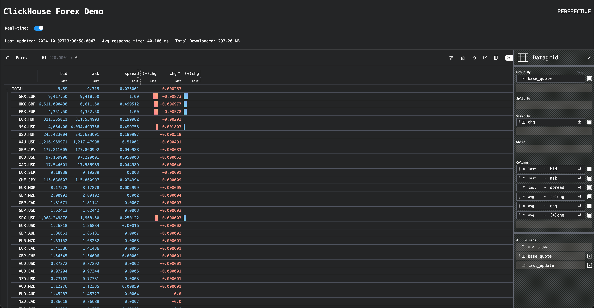

# ClickHouse-Perspective example

This demo shows off ClickHouse can be used to power [Perspective](https://perspective.finos.org/) visualizations using Apache Arrow format. This demo shows forex ticks in real-time.

The blog supporting this demo can be found [here]().



A live version of this demo is available at [https://perspective-clickhouse.vercel.app/](https://perspective-clickhouse.vercel.app/).

## Deployment

By default this demo queries a [public instance of ClickHouse](./perspective-forex/blob/main/index.js#L6-L7). All querying is executed in the browser (no server side code), with just  `index.html`,  `index.js` and `index.css` files.

To run, just serve these in a http server. For example, if using [`http-server`](https://www.npmjs.com/package/http-server).

```bash
http-server .

Available on:
  http://127.0.0.1:8081
Hit CTRL-C to stop the server
```

If users wish to run against their own ClickHouse instance, modify the url and credentials [here](./perspective-forex/blob/main/index.js#L6-L7).

## Dataset

This demo uses a Forex dataset, shifted to the current period. Users can load this sample dataset from public S3 files. Specifically, the following `INSERT INTO SELECT` will ensure data is available for the current period.

**The default Forex dataset goes upto `2022-08-26`. The following can can be adjusted to reduce the dataset size e.g. >=2022**

```sql
INSERT INTO forex SELECT datetime + INTERVAL 3 YEAR, bid, ask, base, quote FROM s3('https://datasets-documentation.s3.eu-west-3.amazonaws.com/forex/parquet/year_month/*.parquet') WHERE toYear(datetime) >= 2021

0 rows in set. Elapsed: 217.718 sec. Processed 2.37 billion rows, 19.66 GB (10.90 million rows/s., 90.30 MB/s.)
Peak memory usage: 734.48 MiB.
```
